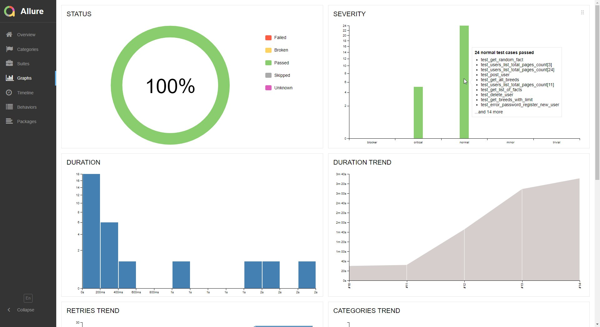

## Проект автотестов для 3-ех APIs: reqres.in, catfact.ninja и demowebshop

<!-- Технологии -->

## :gear: Используемые технологии
<p  align="center">
  <code></code>
  <code></code>
  <code></code>
  <code></code>
  <code></code>
  <code></code>
  <code></code>
  <code></code>
  <code></code>
  <code></code>
  <code></code>
  <code></code>
  <code></code>
<!--   <code></code> -->
  <code></code>
</p>

## :open_book: Описание
В проекте представлены примеры API автоматизации тестирования на Python.
  
API тесты на платформе `reqres.in`  
  
API тесты на платформе `catfact.ninja`  
  
API + WEB тесты  на платформе `demowebshop` - демонстрация гибридных тестов WEB и API (например, авторизация через API)  
  
Подключена система отчетности Allure Reports с вложениями (логи, скриншоты, видео и пр.)   
  
В UI-тестах шаги отображены в виде степов через `with allure.step`  
  
Также по факту прохождения теста отправляется уведомление с результатами в Telegram.  
  
Браузер в UI-тестах запускается удаленно в Selenoid.  

## :heavy_check_mark: Кратко
- [x] `API` тесты
- [x] `Гибридные` тесты (API + WEB)
- [x] `Параметризованный` запуск тестов
- [x] Запуск WEB тестов, используя `Jenkins` и `Selenoid`
- [x] `Allure Reports` с вложениями (логи, скриншоты, видео)
- [x] Отправка результатов тестирования в `Telegram`

<!-- Тест кейсы -->

## :heavy_check_mark: Что проверяют API тесты (reqres.in, catfact.ninja)

- [x] Создание новой сущности/пользователя
- [x] Обновление сущности/пользователя
- [x] Удаление сущности/пользователя
- [x] Регистрация новой сущности/пользователя

## :heavy_check_mark: Что проверяют WEB тесты (demowebshop)
- [x] Авторизация через UI
- [x] Авторизация через API без фикстуры с помощью авторизационной куки
- [x] Добавление товара в корзину через API (POST-запрос)
- [x] Добавление товара в корзину через API с помощью модели
- [x] Добавление товара в корзину через API с помощью модели и сессии (`from requests import sessions`)

<!-- Jenkins -->

##  Запуск тестов из Jenkins

Для запуска тестов из Jenkins:
1. Нажмите кнопку "Собрать с параметрами"

<p></p>

2. Выберите параметры

<p></p>

3. Нажмите "Собрать"

<!-- Отчеты -->

## :bar_chart: Отчеты о прохождении тестов доступны в Allure

> При локальном запуске введите в командной строке: 
```bash
allure serve 
```

###  Allure

#### Примеры отображения тестов


#### Во вкладке Graphs можно посмотреть графики о прохождении тестов, по их приоритезации, по времени прохождения и др.



###  Telegram

Настроена отправка отчета в Telegram


